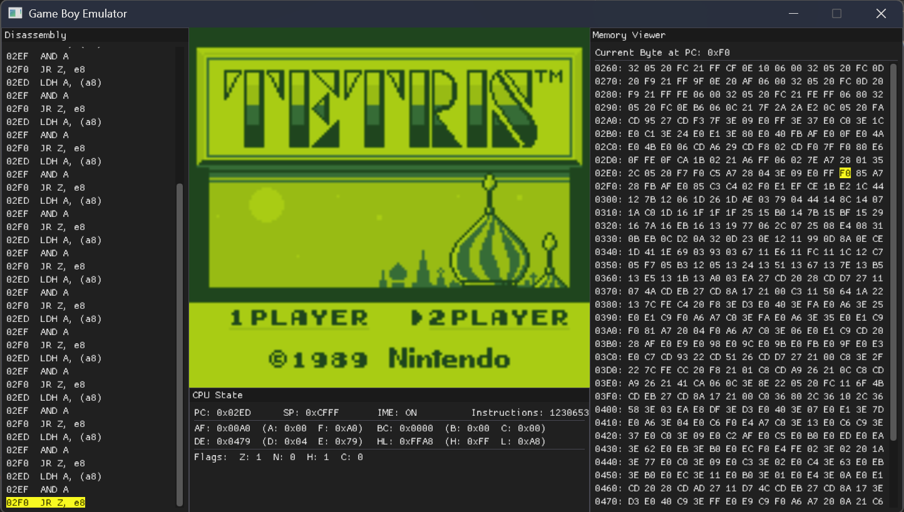

# Game Boy Emulator (gbemu)

A Game Boy emulator implementation in C++ with complete graphics, input, and comprehensive documentation.

## Documentation

Detailed development documentation with step-by-step explanations is available in the `docs/` folder. Open `docs/index.html` in a browser to view:

- Disassembler implementation
- CPU and memory systems
- Instruction set implementation (Part 1 & 2)
- Input system and PPU rendering

## Screenshot



*Tetris running in the emulator with debug panels showing CPU state and registers*

## Features

- **CPU Emulation Core**
  - Accurate Game Boy CPU (Sharp LR35902) emulation
  - Complete register set (AF, BC, DE, HL, SP, PC)
  - Flag register management (Z, N, H, C)
  - Instruction execution with cycle-accurate timing
  - Frame-based execution loop (~59.7 Hz)
  - Interrupt handling (VBlank, LCD STAT, Timer, Serial, Joypad)
  - HALT bug (IME=0 with pending interrupt causes PC not to advance on next fetch)

- **PPU (Picture Processing Unit)**
  - Background layer with scrolling (SCX/SCY registers)
  - Window layer with line counter
  - Sprite/Object rendering (8x8 and 8x16 modes)
  - OAM scanning with 10 sprites per scanline limit
  - Sprite priority system and transparency
  - X/Y flipping for sprites
  - All PPU modes and timing (OAM Search, Drawing, H-Blank, V-Blank)
  - LCDC and STAT register support

- **Input System**
  - Joypad register (0xFF00) with button group selection
  - Keyboard input support (Z/X for A/B, arrows, Enter/Shift)
  - Gamepad/Controller support via SDL3
    - Xbox controllers (Xbox One, Series X|S)
    - PlayStation controllers (DualShock 4, DualSense)
    - Nintendo Pro Controllers
    - Generic controllers via SDL gamepad database
  - Hot-plugging support for controllers

- **Timer System**
  - DIV register (0xFF04)
  - TIMA/TMA/TAC with all 4 clock speeds
  - Timer overflow interrupt

- **Serial Port**
  - Master-mode (0x81) transfers complete immediately for Blargg test compatibility
  - Slave-mode (0x80) transfers stall — prevents false link-cable detection

- **Memory Management**
  - 64KB address space
  - ROM loading support
  - Cartridge memory mapping (0x0000-0x7FFF)
  - Video RAM (VRAM) at 0x8000-0x9FFF
  - OAM (Object Attribute Memory) at 0xFE00-0xFE9F
  - Work RAM (0xC000-0xDFFF)
  - I/O registers (0xFF00-0xFF7F)
  - High RAM (0xFF80-0xFFFE)
  - Memory Bank Controllers (MBC1, MBC2, MBC3, MBC5)
    - ROM banking (up to 512 banks / 8MB)
    - External RAM banking with enable/disable
    - MBC1 mode 0/1 (ROM/RAM banking modes)
    - MBC2 built-in 512×4-bit RAM
    - MBC3 RTC register latch
    - MBC5 9-bit ROM bank number

- **Audio Processing Unit (APU)**
  - CH1: Square wave with frequency sweep (NR10–NR14)
  - CH2: Square wave (NR21–NR24)
  - CH3: Wave channel with 32-nibble custom waveform (NR30–NR34)
  - CH4: Noise channel with 15-bit/7-bit LFSR (NR41–NR44)
  - Frame sequencer at 512 Hz: length (256 Hz), sweep (128 Hz), envelope (64 Hz)
  - Volume envelope on CH1, CH2, CH4 (configurable pace, fade in/out)
  - Frequency sweep on CH1: overflow check on trigger and on each clock; negate-mode exit immediately disables channel
  - NR51 per-channel stereo panning, NR50 master volume (1–8 per side)
  - NR52 master enable/disable; length counters preserved through power cycles (DMG hardware behaviour)
  - NR41 (CH4 length register) writable while APU powered off (DMG hardware behaviour)
  - Wave channel read/write while active accesses currently-playing Wave RAM position (DMG hardware behaviour)
  - SDL3 stereo audio stream at 44,100 Hz, 16-bit signed
  - Frame-paced audio delivery

- **Complete Game Boy Instruction Disassembler**
  - All 256 standard opcodes (0x00-0xFF)
  - All 256 CB-prefixed opcodes (0xCB00-0xCBFF)
  - Comprehensive instruction metadata (flags, cycle counts, lengths)
  - Formatted output with operand values

## Building

### Prerequisites
- C++23 compatible compiler (Clang 17+, GCC 13+)
- CMake 3.20+
- Git (for submodule initialization)

### Getting the Source

After cloning the repository, initialize and fetch the submodules (SDL3 and ImGui):

```bash
# Clone and initialize submodules in one step
git clone --recurse-submodules https://github.com/yourusername/gbemu.git

# Or, if you already cloned without submodules
git submodule update --init --recursive
```

### Build Steps

```bash
# Configure build (Release by default)
cmake -B build

# Build project
cmake --build build

# Optional: Run tests
ctest --test-dir build --verbose
```

### Build Options

**Build with custom optimization:**
```bash
cmake -B build -DCMAKE_BUILD_TYPE=Release
cmake --build build
```

**Windows: Use clang-cl for better optimization:**
```powershell
# If you previously configured with MSVC, remove the build dir first
Remove-Item -Recurse -Force build
cmd /c '"C:\Program Files\Microsoft Visual Studio\2022\Community\VC\Auxiliary\Build\vcvarsall.bat" x64 && cmake -B build -G "Visual Studio 17 2022" -T ClangCL'
cmake --build build --config Release
```

The build system uses:
- `-march=native` on Linux/macOS/Windows (clang-cl) for maximum optimization
- `/arch:AVX2` on Windows (MSVC only)
- `-O3` optimization level

## Usage

### Run Emulator

```bash
# Linux/macOS
./build/bin/gbemu rom.gb

# Windows
.\build\bin\Release\gbemu.exe rom.gb

# Disassemble only (no execution)
./build/bin/gbemu rom.gb --disassemble       # Linux/macOS
.\build\bin\Release\gbemu.exe rom.gb -d      # Windows (short form)
```

**Controls:**

Keyboard:
- **Z** - A button
- **X** - B button
- **Arrow Keys** - D-Pad
- **Enter** - Start
- **Shift** - Select

Gamepad (Xbox/PlayStation/Nintendo Pro):
- **South button** (A/✕/B) - A button
- **East button** (B/○/A) - B button
- **D-Pad** - D-Pad
- **Start/Menu/+** - Start
- **Back/Share/−** - Select

Controllers are automatically detected and can be hot-plugged during gameplay.

**Disassembler Mode** (`--disassemble` or `-d`): Outputs a formatted table showing:
- **Addr**: Instruction address (hex)
- **Instruction**: Mnemonic and operands with actual values
- **Flags**: Affected CPU flags (Z, N, H, C) or `-`
- **Len**: Instruction length in bytes
- **Cycles**: CPU cycles (shows conditional variants as fractions, e.g., `8/20`)

### Debug Mode

To enable debug tracing (shows each instruction as executed), build with debug features:

```bash
# Configure with debug features enabled
cmake -B build -DGBEMU_DEBUG=ON

# Build
cmake --build build --config Release  # Windows
cmake --build build                   # Linux/macOS

# Run - will show instruction trace
./build/bin/gbemu rom.gb                     # Linux/macOS
.\build\bin\Release\gbemu.exe rom.gb         # Windows
```

**Debug output** shows detailed CPU state and instruction trace:
```
Executing: 0xC3 at PC: 0x0101
JP $0150
CPU State after execution:
A: 00  B: 00  C: 00  D: 00  E: 00  H: 00  L: 00  SP: FFFE  PC: 0150
Flags: Z=0 N=0 H=0 C=0
Cycles: 16
---
```

### Run Tests

```bash
# Linux/macOS
ctest --test-dir build --verbose

# Windows (with Visual Studio generator)
ctest --test-dir build -C Release --verbose

# Or run test binary directly
./build/bin/test_disasm              # Linux/macOS
.\build\bin\Release\test_disasm.exe  # Windows
```

The test suite covers all 256+ Game Boy instructions with complete register and bit position coverage.

## Project Structure

```
.
├── CMakeLists.txt              # Build configuration
├── .gitignore                  # Git ignore rules
├── src/
│   ├── main.cpp               # Entry point with SDL integration
│   ├── gameboy.h              # Game Boy system declarations
│   ├── gameboy.cpp            # Game Boy system implementation
│   ├── cpu.h                  # CPU declarations
│   ├── cpu.cpp                # CPU implementation
│   ├── memory.h               # Memory system declarations
│   ├── memory.cpp             # Memory system implementation
│   ├── ppu.h                  # PPU/graphics declarations
│   ├── ppu.cpp                # PPU/graphics implementation
│   ├── disassembler.h         # Instruction disassembler declarations
│   ├── disassembler.cpp       # Instruction disassembler implementation
│   └── test_disasm.cpp        # Comprehensive test suite
├── docs/                       # HTML documentation
│   ├── index.html             # Introduction and table of contents
│   ├── disassembler.html      # Disassembler documentation
│   ├── cpu_and_memory.html    # CPU and memory systems
│   ├── instructions_part1.html # Instruction implementation
│   ├── instructions_part2.html # More instructions
│   ├── input_and_rendering.html # Input and PPU systems
│   └── style.css              # Documentation styling
├── vendor/                     # Third-party dependencies (SDL3, ImGui)
└── README.md                   # This file
```

## Architecture

### Disassembler

The disassembler is built around a struct-based instruction representation:

```cpp
struct Instruction {
    std::string mnemonic;
    std::string operands;
    std::vector<std::string> affected_flags;
    uint8_t length;
    uint8_t cycles;
    uint8_t cycles_taken;  // For conditional instructions
};
```

**Key Components:**
- `decode_instruction()`: Decodes standard opcodes (0x00-0xFF)
- `decode_cb_instruction()`: Decodes CB-prefixed opcodes (0xCB00-0xCBFF)
- `Instruction::format()`: Formats instruction with actual operand values
- `print_disassembly()`: Batch disassembly with formatted output

### CPU Emulation

The CPU emulation uses a struct-based design with union register pairs for efficient 8-bit/16-bit access:

```cpp
struct CPU {
    RegisterPair bc, de, hl, af;  // 8/16-bit register pairs
    uint16_t sp, pc;               // Stack pointer, Program counter
    
    int execute(Memory& memory);   // Execute one instruction
};
```

**Key Features:**
- Register pairs use unions for dual 8-bit/16-bit access (e.g., `bc.high`, `bc.low`, `bc.pair`)
- Flag register helpers for Z, N, H, C flags
- Cycle-accurate instruction timing
- Integration with disassembler for debugging unimplemented opcodes

### Memory System

The memory system provides a flat 64KB address space with proper region mapping:

```cpp
struct Memory {
    std::vector<uint8_t> rom;      // Cartridge ROM (0x0000-0x7FFF)
    std::array<uint8_t, 8192> wram; // Work RAM (0xC000-0xDFFF)
    std::array<uint8_t, 127> hram;  // High RAM (0xFF80-0xFFFE)
    
    uint8_t read(uint16_t address);
    void write(uint16_t address, uint8_t value);
};
```

### PPU (Picture Processing Unit)

The PPU handles all graphics rendering with three layers:

```cpp
struct PPU {
    std::array<uint8_t, 23040> rgba_buffer;  // 160x144 RGBA framebuffer
    std::array<Sprite, 10> visible_sprites;  // Up to 10 sprites per scanline
    uint8_t window_line_counter;             // Internal window line counter
    
    void step(int cycles, Memory& memory);   // Execute PPU for N cycles
    void render_scanline(Memory& memory);    // Render current scanline
};
```

**Key Features:**
- Background rendering with tile data from VRAM
- Window layer for UI overlays (separate from background scrolling)
- Sprite rendering with OAM scanning
- 4 PPU modes: OAM Search (80 cycles), Drawing (172 cycles), H-Blank (204 cycles), V-Blank
- Proper sprite priority (lower OAM index = higher priority)
- Sprite attributes: X/Y flip, palette selection, BG priority

### Game Boy System

The `GameBoy` struct integrates CPU, memory, PPU and APU with timing control:

```cpp
struct GameBoy {
    Memory memory;
    CPU cpu;
    PPU ppu;
    APU apu;
    
    int step();                    // Execute one instruction
    int step_frame();              // Execute one frame (~70224 cycles)
    void run();                    // Main emulation loop
};
```

**Timing Constants:**
- CPU Frequency: 4.194304 MHz
- Frame Rate: ~59.7 Hz
- Cycles per Frame: ~70224
- Cycles per Scanline: 456
- Scanlines per Frame: 154 (144 visible + 10 V-Blank)

### Implementation Details

- Uses C++23 features including `std::print` and `std::format` for formatted output
- SDL3 for window management, rendering, and input handling
- ImGui for debug UI and CPU state visualization
- Modular design with separate header and implementation files
- Cross-platform file handling with `std::filesystem`
- Optimized builds with `-march=native` (Linux/macOS/Windows with clang-cl) or `/arch:AVX2` (Windows with MSVC)

## Testing

The test suite (`test_disasm.cpp`) includes:
- All 256 standard Game Boy opcodes
- All 256 CB-prefixed opcodes
- Complete coverage of:
  - All 8 registers (B, C, D, E, H, L, (HL), A)
  - All 8 bit positions (0-7) for BIT/RES/SET instructions
  - Rotate, shift, and bitwise operations
  - Load, arithmetic, and control flow instructions

Total test coverage: 630+ bytes covering 350+ unique instructions

## Example Output

```
Addr  Instruction           Flags       Len  Cycles
----  --------------------  --------    ---  ------
0000  NOP                   -             1  4    
0001  LD $1234              -             3  12   
0004  LD B, B               -             1  4    
0005  ADD A, B              Z,0,H,C       1  4    
0079  RLC B                 Z,0,0,C       2  8    
00F9  BIT 0, B              Z,0,1,-       2  8    
0179  RES 0, B              -             2  8    
01F9  SET 0, B              -             2  8    
```

## Development

### Design Approach

- Struct-based instruction representation
- Direct binary file I/O with `fopen`/`fread`
- RAII for resource management

## Current Status

**Fully playable!**

The emulator successfully runs Tetris and Pokémon, passes all 11 Blargg cpu_instrs tests, and produces full stereo audio. MBC1–MBC5 cartridge support enables the full commercial game library.

### Implemented Features

**CPU Instructions: ~100% of instruction set**
- ✅ Control flow: JP, JR, CALL, RET (conditional/unconditional)
- ✅ Data transfer: LD (all variants: r8, r16, immediate, (HL+/-), direct memory, (BC)/(DE))
- ✅ Arithmetic: INC, DEC, ADD, SUB, CP, ADC, SBC (8-bit and 16-bit variants, all registers + immediate)
- ✅ Logical: XOR, OR, AND, BIT, RES, SET, RL, RLC, RR, RRC, SLA, SRA, SRL, SWAP
- ✅ Interrupt control: DI, EI, RETI
- ✅ Stack operations: PUSH, POP (all register pairs)
- ✅ Miscellaneous: NOP, HALT (with HALT bug), DAA, CPL, CCF, SCF, RLCA, RRCA, RLA, RRA

**Graphics/PPU:**
- ✅ Background rendering with scrolling (SCX/SCY)
- ✅ Window layer with proper line counter
- ✅ Sprite rendering (8x8 and 8x16 modes)
- ✅ OAM scanning (40 sprites, 10 per scanline)
- ✅ Sprite attributes (priority, flip X/Y, palettes)
- ✅ All PPU modes and timing (456 cycles per scanline)
- ✅ V-Blank, LCD STAT, and Timer interrupts

**Timers:**
- ✅ DIV register (0xFF04)
- ✅ TIMA/TMA/TAC timer with all 4 clock speeds
- ✅ Timer overflow interrupt

**Serial:**
- ✅ Master-mode (internal clock) transfers complete immediately
- ✅ Slave-mode (external clock) transfers stall — no false link-cable detection

**Input:**
- ✅ Joypad register (0xFF00) implementation
  - ✅ Joypad interrupt (INT_JOYPAD) on button press
  - ✅ Wake from STOP on joypad interrupt
- ✅ Keyboard control (Z/X/Arrows/Enter/Shift)
- ✅ Gamepad support (Xbox/PlayStation/Nintendo Pro)
- ✅ Controller hot-plugging

**Memory Bank Controllers:**
- ✅ MBC1 with mode 0/1 (ROM/RAM banking)
- ✅ MBC2 with built-in 512×4-bit RAM
- ✅ MBC3 with RTC register latch and clock ticking
- ✅ MBC5 with 9-bit ROM bank number
- ✅ External RAM enable/disable
- ✅ Cartridge header parsing (type, ROM size, RAM size)
- ✅ Battery-backed save files (.sav) with RTC persistence

**Audio (APU):**
- ✅ CH1 square wave: all duty cycles, envelope, frequency sweep
- ✅ CH2 square wave: all duty cycles, envelope
- ✅ CH3 wave channel: 32-nibble wave RAM, four output levels
- ✅ CH4 noise channel: 15-bit and 7-bit LFSR modes
- ✅ Frame sequencer (length, sweep, envelope clocks)
- ✅ Volume envelopes on CH1, CH2, CH4
- ✅ Frequency sweep on CH1: overflow on trigger and clock, negate-mode exit disables channel
- ✅ NR51 stereo panning, NR50 master volume, NR52 master enable with DMG power-cycle behaviour
- ✅ Wave channel active read/write redirects to currently-playing position
- ✅ 44,100 Hz stereo output via SDL3 audio stream

**Documentation:**
- ✅ Comprehensive HTML documentation covering all implemented systems
- ✅ Step-by-step development log

### Test ROM Results

**Blargg cpu_instrs — all tests pass:**
- ✅ 01: special
- ✅ 02: interrupts
- ✅ 03: op sp,hl
- ✅ 04: op r,imm
- ✅ 05: op rp
- ✅ 06: ld r,r
- ✅ 07: jr,jp,call,ret,rst
- ✅ 08: misc instrs
- ✅ 09: op r,r
- ✅ 10: bit ops
- ✅ 11: op a,(hl)

**Blargg dmg_sound — 8 of 12 tests pass:**
- ✅ 01: registers
- ✅ 02: len ctr
- ✅ 03: trigger
- ✅ 04: sweep
- ✅ 05: sweep details
- ✅ 06: overflow on trigger
- ✅ 07: len sweep period sync
- ❌ 08: len ctr during power (power-cycle counter preservation timing)
- ❌ 09: wave read while on (requires CPU bus timing fix)
- ❌ 10: wave trigger while on (requires CPU bus timing fix)
- ✅ 11: regs after power
- ❌ 12: wave write while on (requires CPU bus timing fix)

**Blargg instr_timing — passes:**
- ✅ instr_timing

**Blargg mem_timing — 0 of 3 tests pass (requires CPU bus timing fix):**
- ❌ 01: read_timing
- ❌ 02: write_timing
- ❌ 03: modify_timing

**Blargg mem_timing-2 — 0 of 3 tests pass (requires CPU bus timing fix):**
- ❌ 01: read_timing
- ❌ 02: write_timing
- ❌ 03: modify_timing

**Blargg oam_bug — 2 of 8 tests pass (OAM corruption quirk not implemented):**
- ❌ 1-lcd_sync
- ❌ 2-causes
- ✅ 3-non_causes
- ❌ 4-scanline_timing
- ❌ 5-timing_bug
- ✅ 6-timing_no_bug
- ❌ 7-timing_effect
- ❌ 8-instr_effect

**Blargg halt_bug — visual-only test (no serial/RAM output, not measurable headlessly)**

**Tetris — fully playable:**
- ✅ Boots to title screen with full graphics
- ✅ Title screen demo timeout (timer-driven countdown)
- ✅ 1-player / 2-player mode selection
- ✅ Falling pieces with correct sprite rendering
- ✅ Background and window layer for playfield and UI
- ✅ Input functional (keyboard and gamepad)
- ✅ V-Blank, LCD STAT, and timer interrupts working
- ✅ Serial port: master-mode transfers complete; slave-mode stalls (no false link-cable detection)

**Pokémon Blue — fully playable:**
- ✅ Title screen, intro sequence, main menu and save/load
- ✅ Overworld exploration with full background music (CH1–CH3) and sound effects (CH4)
- ✅ Battle system with CH3 wave melody and CH4 noise effects
- ✅ APU power cycling between screens (buildings, battles, menu transitions)

## Future Work

- **Save state functionality**
- **Debugger interface** (memory viewer, breakpoints)
- **Game Boy Color support**

## License

MIT

## Resources

- [Game Boy CPU Manual](https://gbdev.io/pandocs/)
